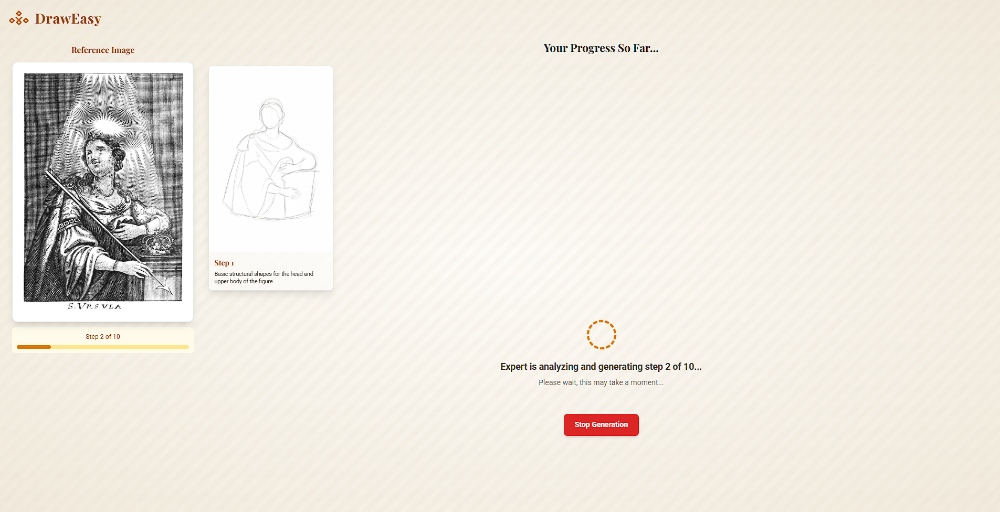
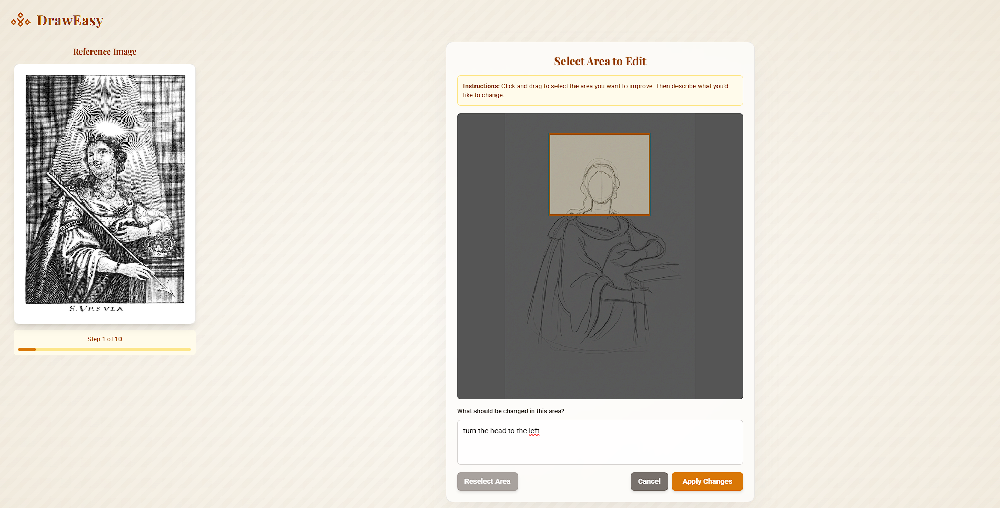
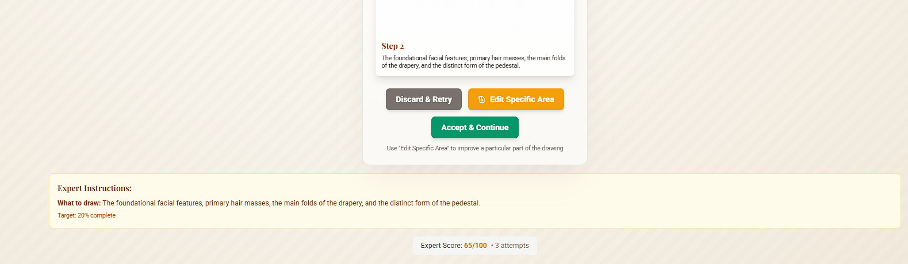
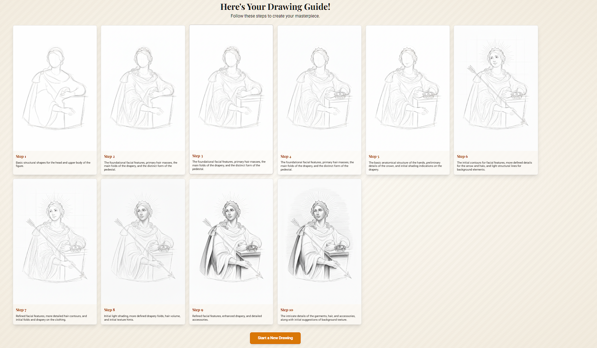

# DrawEasy - AI-Powered Drawing Tutorial Generator

DrawEasy is a web application that transforms any drawing into an interactive step-by-step tutorial using artificial intelligence. The app analyzes a reference image and automatically generates 10 progressive steps to teach how to draw the object, with the ability to customize each step through user feedback.

## 🎯 Key Features

- **Intelligent AI Analysis**: Uses Gemini 2.5 Flash to analyze images and create structured tutorial plans
- **Progressive Generation**: Creates 10 steps from basic shapes to final details
- **Quality Control**: Automatic validation system with intelligent scoring and retry mechanisms
- **Interactive Feedback**: Ability to accept, reject, or modify each step
- **Precise Editing**: Modify specific image areas with targeted feedback
- **Responsive Tutorials**: Adaptive layout for desktop and mobile

## 🏗️ Architecture and Technologies

### Frontend
- **React 19.1.1** - Main framework for user interface
- **TypeScript** - Static typing for increased robustness
- **Tailwind CSS** - CSS framework for rapid and responsive styling
- **Vite** - Modern and fast build tool

### Backend/AI Services
- **Google Gemini 2.5 Flash** - AI model for analysis and image generation
- **Google Gemini 2.5 Flash Image Preview** - Specialized model for image generation
- **Structured JSON Output** - Rigorous JSON schemas for consistent output

### 3-Stage AI Workflow

The system implements a sophisticated workflow that simulates a drawing expert:

1. **Expert Analysis** (`generateFirstStepInstructions`)
   - Analyzes the reference image
   - Creates the plan for the first step (very simple)
   - Determines the complete tutorial progression

2. **Illustrator Generation** (`generateImageFromInstructions`)
   - Transforms textual instructions into images
   - Maintains logical step-by-step progression
   - Applies specific user feedback

3. **Quality Validation** (`expertValidateImage`)
   - Evaluates the quality of each generated step
   - Assigns a score from 0-100
   - Provides feedback for improvements
   - Decides whether to proceed or regenerate

## 🎮 Application States

The app manages 5 main states through a state machine:

- **IDLE**: Initial upload screen
- **LOADING**: AI is generating a new step
- **AWAITING_USER_INPUT**: User needs to decide on a proposed step
- **RESULTS**: Tutorial completed, shows final gallery
- **ERROR**: Error handling with retry option

## 📱 User Interface

### 1. Generation in Progress

During generation, the app shows:
- Animated loading indicator
- Dynamic status message
- Tutorial progress bar
- Button to stop generation
- Sidebar with reference image



### 2. Edit Specific Area

Advanced feature that allows you to:
- Select a specific area of the image
- Provide targeted feedback for that area
- Get more precise regenerations
- Keep the rest of the drawing unchanged



### 3. Expert Instructions and Scoring

Complete transparency of the AI process:
- Shows detailed expert instructions
- Displays quality score (0-100)
- Indicates number of attempts made
- Explains what to draw and what to avoid



### 4. Final Gallery

Final result of the tutorial:
- Responsive grid with all steps
- Detailed descriptions for each step
- Layout optimized for different devices
- Button to start a new tutorial



## 🎥 Demo Video

Watch the complete video showing the entire application flow:

[](DemoResources/demo_video_draw_easy.mp4)

## 🚀 Installation and Setup

### Prerequisites
- Node.js 18+ 
- NPM or Yarn
- Google Gemini API Key

### Installation

```bash
# Clone the repository
git clone <repository-url>
cd draw-step-by-step-ai

# Install dependencies
npm install

# Configure environment variable
echo "GEMINI_API_KEY=your_gemini_api_key_here" > .env.local

# Start the application in development mode
npm run dev
```

### Production Build

```bash
# Create optimized build
npm run build

# Preview the build
npm run preview
```

## 🔧 Configuration

### Environment Variables

Create a `.env.local` file in the project root:

```env
GEMINI_API_KEY=your_google_gemini_api_key_here
```

### API Configuration

The app uses two Gemini models:
- `gemini-2.5-flash` for analysis and validation
- `gemini-2.5-flash-image-preview` for image generation

## 📊 Quality System

### Automatic Scoring
- **70-100**: Step approved automatically
- **50-69**: Acceptable step but with room for improvement  
- **0-49**: Step rejected, requires regeneration

### Intelligent Retry
- Maximum 3 attempts per step
- Progressive feedback for improvements
- Automatic selection of best attempt if none reaches threshold

## 🎨 Customization

### Step Modification
Users can:
- **Accept**: Proceed to next step
- **Reject**: Regenerate with general feedback
- **Edit Area**: Improve a specific area

### Structured Feedback
The system accepts natural language feedback and translates it into precise instructions for the AI.

## 🔍 Code Architecture

### File Structure
```
src/
├── components/          # React Components
│   ├── ImageUploader.tsx
│   ├── StepInteractor.tsx
│   ├── AreaSelector.tsx
│   ├── StepsGallery.tsx
│   └── ...
├── services/           # AI Services
│   └── geminiService.ts
├── types.ts           # TypeScript Definitions
└── App.tsx           # Main Component
```

### Architectural Patterns
- **State Machine**: App state management
- **Callback Pattern**: Component communication
- **Service Layer**: AI logic separation from frontend
- **Type Safety**: TypeScript for robustness

## 🤖 Advanced AI Logic

### Prompt Engineering
Prompts are optimized for:
- **Simplicity**: First step always very basic
- **Progression**: Each step adds details gradually
- **Consistency**: Maintains style and proportions
- **Educational**: Focus on step-by-step learning

### Multi-Criteria Validation
The AI expert evaluates:
- Adherence to instructions
- Appropriate detail level
- Correct proportions
- Logical progression from previous step

## 🛠️ Development and Contributing

### Available Scripts
```bash
npm run dev      # Development with hot reload
npm run build    # Optimized build for production
npm run preview  # Preview the build
```

### Contributing Guidelines
1. Maintain strict TypeScript typing
2. Follow existing naming patterns
3. Add comments for complex logic
4. Test on different devices and resolutions

## 📄 License

This project is released under the MIT license. See the `LICENSE` file for details.

## 🙏 Acknowledgments

- Google Gemini for advanced AI APIs
- Tailwind CSS for the design system
- React team for the excellent framework
- Vite for the modern development experience

---

**DrawEasy** - Transform every drawing into a learning adventure! 🎨✨
